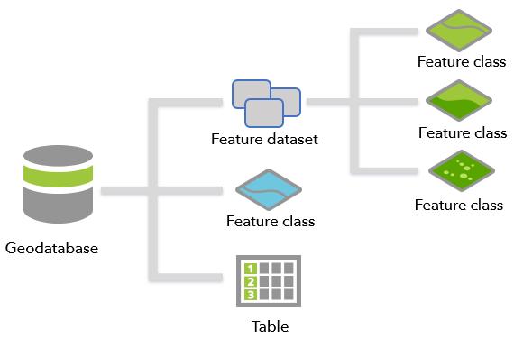
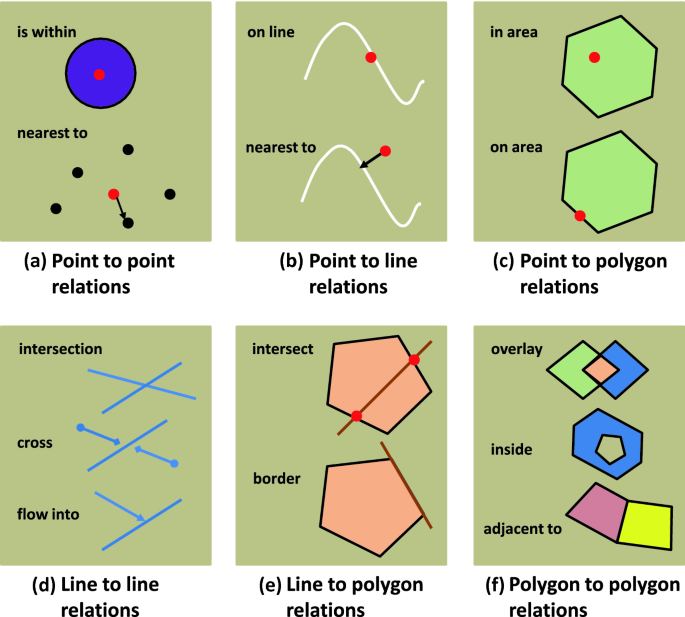

# ArcGIS Data Integrity & Validation Workflow

This project demonstrates workflow for building a geodatabase in ArcGIS Pro using Python (`arcpy`) — from raw spatial datasets to a validated data model. It ensures spatial and attribute integrity through structured schema design, domains, subtypes, contingent values, attribute rules, and topology validation.

## Key Steps

### 1. Geodatabase & Schema Setup
- Creates a File Geodatabase with multiple feature datasets (**Boundaries**, **Transportation**, **Education**) using consistent spatial references.
- Imports shapefiles and CAD features into their respective datasets.

### 2. Subtypes & Relationship Classes
- Defines subtypes (e.g., residential/commercial lot types) to categorize parcels.
- Establishes composite relationship classes between parcels and building outlines for logical data linkage.

### 3. Domains & Contingent Values
- Creates coded value domains for road attributes such as *Accessibility* and *Seasonality*.
- Implements contingent value rules to ensure attribute consistency (e.g., unpaved roads can only be seasonal).

### 4. Attribute Rules & Quality Checks
- Adds validation and constraint rules via Arcade expressions to check engineering tolerances (e.g., pipe wall thickness and operating pressure ranges).
- Enables editor tracking and global IDs to support rule enforcement.

### 5. Topology & Spatial Integrity
- Builds geodatabase topology to enforce spatial rules:
  - Buildings must be within parcels.
  - Parcels and buildings must not overlap.
- Validates topology and exports any errors for review.

---

## Highlights
- **End-to-End Automation** – Every step, from importing source data to enforcing integrity constraints, is scripted in `arcpy` for repeatability.
- **QA/QC** – Incorporates both attribute-level and spatial-level checks.
- **Standards-Based Design** – Follows Esri best practices for geodatabase modeling, adaptable to municipal, utility, or infrastructure datasets.

---

### 📂Geodatabase Schema

### Topology Relationships

---

## ⚙Tech Stack
- **ArcGIS Pro** with Python (`arcpy`)
- Spatial datasets (Shapefile, CAD)
- Arcade expressions for attribute rules
- File Geodatabase for data storage

# Clone repository
git clone https://github.com/madhurdevkota/arcgis-data-integrity-workflow.git

#### Open ArcGIS Pro Python environment
#### Run the main Python Jupyter Notebook
ArcGIS_Data_Integrity.ipynb
